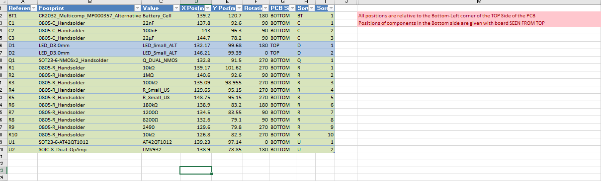

# Kicad Python Scripts

This repo contains a bunch of Python scripts that I use quite frequently in my KiCad projects. They are obviously quite tied to the way I work and might not fit yours, but maybe they are a good starting point for you to adapt them to something that suits you better. I'm not the best Python programmer, I'm just trying to put something together that works.

Some (most) of them are meant to be used with my other project `KiCad CD` (name in progress, I hate it :D, it might change by the time you read this). The idea is to be able to get production files of your KiCad project in a repeatable manner. Check that other project too, please.

This project uses bits and bobs from other people:

* **KiBoM**: [(https://github.com/SchrodingersGat/KiBoM)](https://github.com/SchrodingersGat/KiBoM) to generate BOMs.
* **KiPlot**: [(https://github.com/johnbeard/kiplot)](https://github.com/johnbeard/kiplot) to generate Gerbers and other plots.
* **GerbV**: [(https://sourceforge.net/projects/gerbv/)](https://sourceforge.net/projects/gerbv/)a couple of my scripts generate projects for GerbV so it's more comfortable to inspect the output.

## Excel BOM Generator

Maybe your company has a format for the BoMs you send. Maybe they don't, and maybe it's about time to get one?

The plugin I used to generate the BOMs, KiBoM has a lot of configuration options, but I couldn't replicate the template we have, and even though it can output Excel files, it can do advanced stuff like sorting by natural order (C1, C2, ..., C9 before C10) or colouring the cells based on the type of component. I wrote a script that takes a KiBOM output file, gets the components and their related info and pastes it to an Excel Template. It also applies some formatting to it.

It's callable from the command line, so you don't need KiCad open to run it.

## Positions Generator

A script that generates the Positions file for your project. It outputs a nicely (well, for my taste) formatted table in an Excel file with all the positions, ready to send to your manufacturer.

## GerbV Project Generator

I use GerbV as my Gerber Viewer. I hate that every time I dump a bunch of gerbers, the layers' order and colours are random, and I have to spend a minute sorting everything. I made a script that takes a folder with gerbers and generates a GerbV project with the Gerbers ordered and coloured based on their contents.

## Visual Diff

HW design software is not nice with Git. Even though files are text, good luck trying to find out what you changed between revisions. This script takes two sets of gerbers and compares them visually, so you can spot what are the differences layer by layer.

## Docker Images

A bunch of docker images I've been toying around, and don't know where to put.
